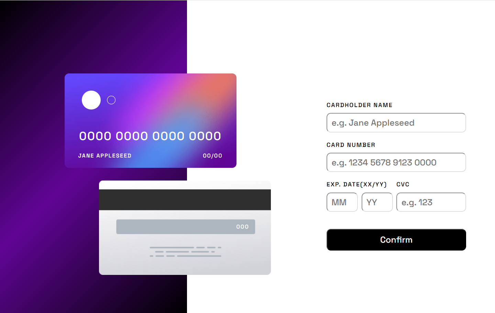

# Frontend Mentor - Interactive card details form solution

This is a solution to the [Interactive card details form challenge on Frontend Mentor](https://www.frontendmentor.io/challenges/interactive-card-details-form-XpS8cKZDWw).  

## Table of contents

- [Overview](#overview)
  - [The challenge](#the-challenge)
  - [Screenshot](#screenshot)
  - [Links](#links)
- [My process](#my-process)
  - [Built with](#built-with)
  - [What I learned](#what-i-learned)
  - [Continued development](#continued-development)
- [Author](#author)

## Overview

### The challenge

Users should be able to:

- Fill in the form and see the card details update in real-time
- Receive error messages when the form is submitted if:
  - Any input field is empty
  - The card number, expiry date, or CVC fields are in the wrong format
- View the optimal layout depending on their device's screen size
- See hover, active, and focus states for interactive elements on the page

### Screenshot



### Links

- Solution URL: [solution in github](https://github.com/Ekin-shieh/interactive-card-details-form)
- Live Site URL: [live site in gitpage](https://ekin-shieh.github.io/interactive-card-details-form/)

## My process

### Built with

-HTML5 – For structuring the web page.
-CSS3 – For styling the layout and responsiveness (including separate files for background, form, error, and success display).
-Vanilla JavaScript – Used for DOM manipulation, real-time form input synchronization, and validation logic.
-Responsive Design (Mobile-First) – Layout adapts to different screen sizes, starting from mobile.
-CSS Flexbox and Grid – For layout arrangement.
-Custom Validation – Implemented manually in JavaScript instead of using HTML pattern or required.
-Dynamic DOM Updates – JavaScript updates the visual card in real time based on user input.

### What I learned

During this project, I gained experience in several key areas of front-end development:

1. **Using CSS Grid for Layout** 
I learned how to use CSS Grid to create structured and responsive layouts. For example:
```css
.short-input {
  display: grid;
  grid-template-columns: 1fr 1fr 2fr;
  gap: 10px;
}
```

2. **Detecting and Formatting User Input**
I implemented logic to format the card number in groups of 4 digits and ensure only numbers are accepted:
```js
let raw = cardNum.value.replace(/\s+/g, '');
raw = raw.replace(/[^0-9]/g, '');
const formatted = raw.replace(/(.{4})/g, '$1 ').trim();
```
3. **Custom Form Validation Logic**
Instead of relying on built-in HTML5 validation, I created custom validation to check the format and completeness of the input:
```js
if (!/^\d{16}$/.test(rawCardNum)) {
  showError('cardnum', 'You should enter 16 digits');
}
```
4. **Toggling Error Message Display with JavaScript**
I handled error feedback by dynamically showing and hiding error boxes based on input status:
```js
function showError(msgId, msg) {
  const el = document.getElementById(msgId + '-error');
  el.textContent = msg;
  el.style.display = 'block';
}

function clearError(msgId) {
  const el = document.getElementById(msgId + '-error');
  el.textContent = '';
  el.style.display = 'none';
}
```

### Continued development

In future projects, I’d like to improve on the following areas:

- Implementing the Luhn algorithm to validate credit card numbers more accurately.
- Enhancing my responsive design skills to handle more complex layouts.
- Exploring TypeScript to write safer and more maintainable JavaScript code.

## Author

- Frontend Mentor - [@Ekin-shieh](https://www.frontendmentor.io/profile/Ekin-shieh)
- GitHub - [@Ekin-shieh](https://github.com/Ekin-shieh)
